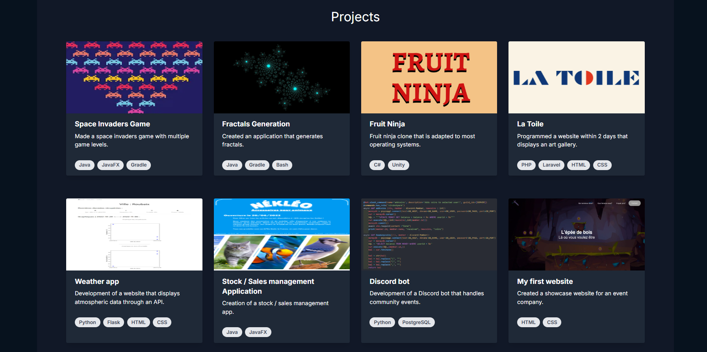

<a id="readme-top"></a>

<div align="center">
  <h1 align="center">portfolio-ts</h1>
  
  <p align="center">
    My personal portfolio website, built with Next.js, TypeScript & Tailwind CSS.
    <br />
    <a href="https://bobeuf-jules.com/">Visit Live Site</a>
</div>

<details>
  <summary>Table of Contents</summary>
  <ol>
    <li><a href="#about-the-project">About The Project</a></li>
    <li><a href="#built-with">Built With</a></li>
    <li><a href="#getting-started">Getting Started</a></li>
    <li><a href="#usage">Usage</a></li>
    <li><a href="#license">License</a></li>
    <li><a href="#contact">Contact</a></li>
    <li><a href="#acknowledgments">Acknowledgments</a></li>
  </ol>
</details>

## About The Project

This is my personal portfolio website. It showcases who I am, my skills and projects. It’s designed to be simple, fast, and responsive — perfect for sharing work and contact details with recruiters or collaborators.


## Built With

[](https://nextjs.org/)  
[](https://www.typescriptlang.org/)  
[](https://tailwindcss.com/)


## Getting Started

### Folder Structure

```markdown
portfolio-ts/
├── 📁 app/             # Main app pages & layouts
│   ├── 📁 components/  # Reusable UI components here
│   └── 📄 page.tsx     # Homepage component file
├── 📁 public/          # Static assets (images, icons)
├── 📁 utils/           # Helper functions for app
├── 📄 package.json     # Project dependencies and scripts
```

### Prerequisites

Make sure you have the following installed:

```sh
node >= 16.x
npm >= 8.x
```

### Installation

1. Clone the repository  
   ```sh
   git clone https://github.com/JulesBobeuf/portfolio-ts.git
   ```
2. Move into the project directory  
   ```sh
   cd portfolio-ts
   ```
3. Install dependencies  
   ```sh
   npm install
   ```
4. Start local development server  
   ```sh
   npm run dev
   ```

### Available Scripts

In the project directory, you can run:

```sh
npm run build
```
Builds the application for production.

```sh
npm run start
```
Runs the built app in production mode.

```sh
npm run lint
```
Runs ESLint to analyze the code for problems.

## Usage

Open your browser and go to `http://localhost:3000` to view the site locally.

## License

Licensed under the MIT License. See the [LICENSE](LICENSE) file for details.

## Contact

Jules Bobeuf  
[LinkedIn](https://www.linkedin.com/in/bobeuf-jules/)  
bobeuf.jules@gmail.com  